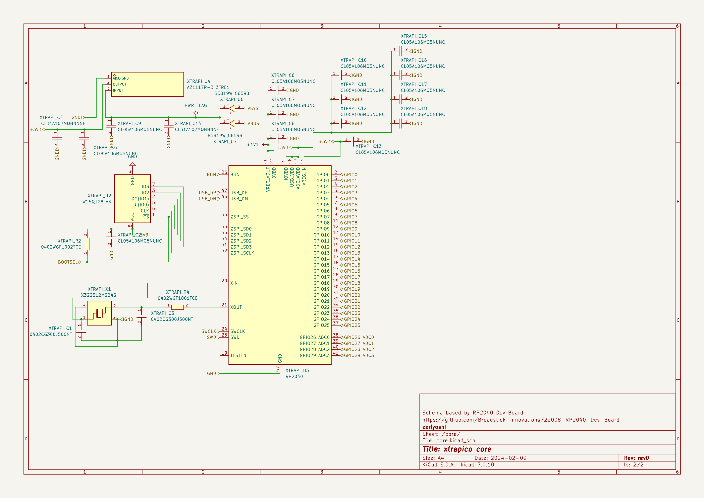
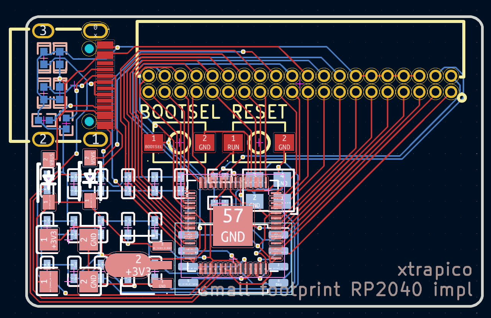

# xtrapico
Double sided extra small footprint RP2040 implementation, Forcus on [JLCPCB](https://jlcpcb.com/).

Schma based by [22008-RP2040-Dev-Board](https://github.com/Breadstick-Innovations/22008-RP2040-Dev-Board)

# License
MIT
